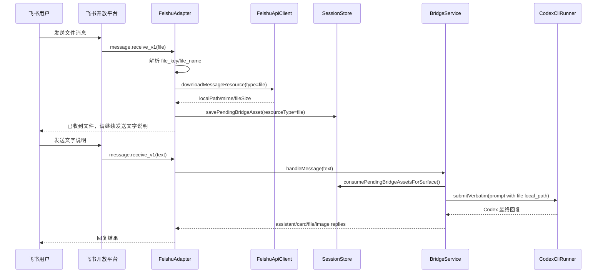
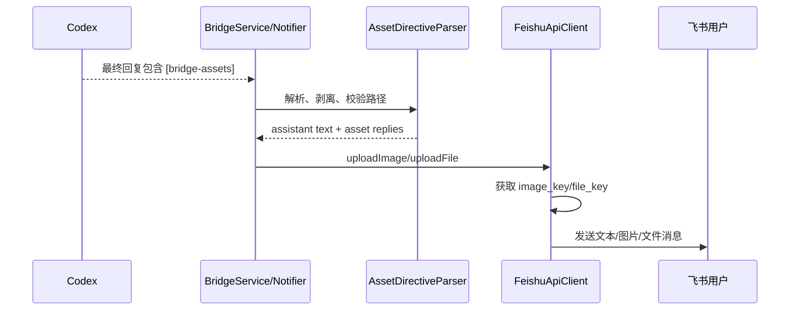

# 飞书与 Codex 会话图片/文件双向桥接 PRD 与方案设计

日期：2026-05-03
状态：方案草案
范围：需求与技术设计，不包含本轮代码实现

## 1. 背景

当前项目已经具备飞书文本消息触发 Codex 会话、进度卡片回传、图片作为 Codex `-i` 输入、以及通过 `[bridge-image]` 指令把本地图片上传回飞书的雏形。新需求希望把这条链路补齐为“图片和文件双向流转”：

1. Codex 会话生成的图片可以返回飞书查看。
2. 飞书发送文件给 Codex 会话后，Codex 能在会话里使用该文件。
3. Codex 会话生成的文件可以返回飞书。

本设计只基于源码、测试和官方飞书文档分析现状；没有读取或修改 `docs/project-full-overview.md`。

## 2. 设计假设

- “Codex 会话生成的图片/文件”在本方案中定义为：Codex 最终回复中能给出桥接进程可访问的本地文件路径，或桥接层能从 Codex 桌面会话记录里解析出等价的本地文件路径。若 Codex 只在外部 UI 中展示二进制内容但没有落盘路径，桥接层无法可靠上传，需要先要求 Codex 将内容保存到本地文件。
- 飞书真实联调仍只覆盖现有允许的 DM 与 `coding-anywhere-autotest` 测试群；不把群话题(topic)纳入本期真实 UI 回归范围。
- 入站文件不会自动改写用户工作区；默认下载到桥接层托管目录，再把路径和元数据交给 Codex。Codex 如需复制、解析或转换文件，应在会话内显式执行。
- 出站图片优先作为飞书原生图片消息发送；超过飞书图片限制或非图片资源走飞书文件消息。
- 文件安全边界沿用当前图片边界：只允许返回当前项目工作目录或桥接托管资源目录下的文件。

## 3. 官方飞书约束

本方案核对了 `open.feishu.cn` 官方文档：

- [发送消息](https://open.feishu.cn/document/server-docs/im-v1/message/create?lang=zh-CN)：支持 `text`、`interactive`、`image`、`file` 等消息类型；向用户或群发消息需要机器人能力，给群组发消息时机器人需要在群内且有发言权限；同一用户或群组发送限频为 5 QPS，接口基础频率限制为 1000 次/分钟、50 次/秒。
- [上传图片](https://open.feishu.cn/document/server-docs/im-v1/image/create?lang=zh-CN)：上传后返回 `image_key`；图片大小不能超过 10 MB，且不能为 0；支持 JPG、JPEG、PNG、WEBP、GIF、BMP、ICO、TIFF、HEIC，其中 TIFF、HEIC 会转为 JPG；GIF 分辨率不能超过 2000 x 2000，其他图片不能超过 12000 x 12000。
- [上传文件](https://open.feishu.cn/document/server-docs/im-v1/file/create?lang=zh-CN)：上传后返回 `file_key`；文件大小不得超过 30 MB 且不能为 0；请求体包含 `file_type`、`file_name`、可选 `duration` 和二进制 `file`。
- [获取消息中的资源文件](https://open.feishu.cn/document/server-docs/im-v1/message/get-2?lang=zh-CN)：可下载指定消息里的图片、文件、音频、视频资源，返回二进制流；机器人和待操作消息需要在同一会话内；仅支持 100 MB 以内资源；`type=image` 对应图片，`type=file` 对应文件、音频、视频；不支持表情包、合并转发子消息和卡片消息内资源。
- [接收消息内容结构](https://open.feishu.cn/document/server-docs/im-v1/message-content-description/message_content?lang=zh-CN)：消息事件/查询结果中的 `content` 是 JSON 字符串，不同 `msg_type` 有不同资源 key 结构。

## 4. 代码现状

### 4.1 已有能力

- `FeishuAdapter` 已能处理飞书 `message_type === "image"`：解析 `image_key`，调用 `downloadMessageResource` 下载图片，保存为 pending asset，并回复“已收到图片，请继续发送文字说明”。
- `FeishuApiClient.downloadMessageResource` 当前调用 `im.v1.messageResource.get`，接口形态已经接近通用资源下载，但类型被限制为 `"image"`。
- `SessionStore` 中 `pending_bridge_assets` 表已经有 `resource_type`、`resource_key`、`local_path`、`file_name`、`mime_type`、`file_size`、`status` 等字段，数据库结构本身可承载文件，只是 TypeScript 类型目前只允许 `image`。
- `BridgeService` 会在下一次用户文本提问时按飞书 surface 消费 pending asset，把图片路径传给 `CodexCliRunner.submitVerbatim(..., { images })`，并在 prompt 中追加 `[bridge-attachments]` 元数据。
- `CodexCliRunner` 已支持将图片路径转为 Codex CLI 的 `-i` 参数。
- Codex 出站已有 `[bridge-image]` 文本指令，`BridgeService` 会剥离该指令、校验路径、生成 `BridgeReply.kind === "image"`；`FeishuAdapter` 和卡片回调服务会上传图片并用飞书原生图片消息发送。

### 4.2 主要缺口

- 入站只支持 `image`，不支持飞书 `file` 消息，也没有解析 `file_key`、`file_name`。
- `BridgeAssetResourceType` 当前只有 `"image"`，导致 store、adapter、service、测试替身都无法类型化表达通用文件。
- `downloadMessageResource` 的 `type` 只允许 `"image"`，但飞书官方资源下载接口需要支持 `"file"`。
- Codex CLI 没有现成的通用文件附件参数；文件输入应通过“本地路径 + 元数据 + 明确提示”交给 Codex，而不是幻想存在 `--file` 参数。
- 出站只有 `[bridge-image]`，没有通用 `[bridge-file]` 或统一 `[bridge-assets]` 协议。
- `BridgeReply` 没有 `file` 类型；`FeishuApiClient` 没有 `uploadFile`、`sendFileMessage`、`replyFileMessage`。
- 桌面 Codex 完成通知只把最终文本渲染为完成卡片；若桌面会话最终文本里包含待返回文件路径，当前不会触发上传。
- 对资源数量、总大小、敏感路径、重复发送、上传失败后的用户提示还没有统一治理。

## 5. 产品目标

### 5.1 一期目标

- 飞书用户可以先发送 1 个或多个图片/文件，再发送文字说明，Codex 会在同一会话里收到这些资源的本地路径与元数据。
- Codex 可以在最终回复中声明需要返回的图片或文件，桥接层自动上传到飞书并发回当前 DM 或群聊。
- 图片继续保留原生图片体验；普通文件以飞书原生文件消息返回。
- 失败时用户能看到明确、可行动的错误说明，例如文件过大、下载失败、路径越界、上传失败。
- 所有真实飞书验证继续限定在 DM 和专用测试群。

### 5.2 非目标

- 不在本期支持飞书话题(topic)真实联调或新增话题夹具。
- 不在本期实现云文档导入、在线预览转换、文件夹消息、合并转发子消息、卡片内资源提取。
- 不自动扫描整个仓库寻找“可能是 Codex 生成的文件”。出站必须由 Codex 最终回复显式声明，或由后续阶段的桌面完成监听显式解析。
- 不绕过飞书 30 MB 文件上传、10 MB 图片上传、100 MB 消息资源下载限制。

## 6. 用户故事

- 作为飞书用户，我发送一张截图后再说“分析这个报错”，Codex 能看到截图并给出分析。
- 作为飞书用户，我发送一个 `.log`、`.csv`、`.xlsx`、`.pdf` 或 `.zip` 后再提问，Codex 能读取下载后的本地文件路径并处理。
- 作为飞书用户，我要求 Codex 生成图表、截图或设计稿，Codex 完成后我能直接在飞书看到图片。
- 作为飞书用户，我要求 Codex 生成报告、表格、压缩包或补丁文件，Codex 完成后我能在飞书收到原生文件消息。
- 作为运维者，我能从日志和数据库记录里追踪某个资源从飞书消息下载、被哪个 run 消费、是否上传回飞书。

## 7. 推荐方案

推荐采用“现有图片链路泛化 + 显式出站指令协议”的方案。

### 7.1 为什么不选择纯自动识别

自动从最终文本里扫描所有 Markdown 图片、文件路径或附件描述，容易误传用户不想公开的本地文件，也容易因 Windows 路径、相对路径、代码块示例而误判。对于飞书回传文件这类有隐私和体积风险的能力，默认应要求 Codex 用结构化指令显式声明。

### 7.2 为什么不选择上传整个产物目录

自动上传 `output/`、`dist/` 或最新修改文件会制造过多噪音，也可能上传构建产物、密钥、日志或大文件。当前仓库已有外科式资源路径白名单思路，应继续沿用。

### 7.3 推荐路径

- 入站资源：复用 `pending_bridge_assets`，把 `image` 扩展为 `image | file`。
- Codex 输入：图片继续传 `-i`；文件通过 prompt 内 `[bridge-attachments]` 暴露本地路径、文件名、MIME、大小、来源消息 ID。
- 出站资源：新增统一 `[bridge-assets]` 指令，兼容旧 `[bridge-image]`。
- 飞书发送：新增 `BridgeReply.kind === "file"`，图片走图片上传，文件走文件上传。
- 桌面完成：完成卡片仍保留，另行解析最终文本中的出站资源指令并追加发送图片/文件。

## 8. 功能设计

### 8.1 入站图片/文件暂存

飞书事件进入 `FeishuAdapter.handleEnvelope` 后：

1. 对 `message_type === "image"` 维持现有逻辑，解析 `image_key`。
2. 新增 `message_type === "file"` 分支，解析 `content` 中的 `file_key`、`file_name`、可选 `file_size`。
3. 调用泛化后的 `downloadMessageResource({ type: "image" | "file" })`。
4. 下载目录继续按 surface 分层：`<assetRoot>/feishu-inbound/<chatType>/<peerId>/<chatId|direct>/<thread|main>/<messageId>/`。
5. 存入 `pending_bridge_assets`，状态为 `pending`。
6. 回复确认文案：
   - 图片：沿用“已收到图片，请继续发送文字说明。”
   - 文件：新增“已收到文件：<file_name>，请继续发送文字说明。”
   - 多文件由飞书逐条事件驱动，下一次文字提问一次性消费同一 surface 下全部 pending 资源。

### 8.2 入站资源消费与 Codex 提示

`BridgeService` 消费 pending assets 后：

- 图片：
  - `resourceType === "image"` 的本地路径继续放进 `runnerOptions.images`，通过 Codex CLI `-i` 输入。
  - 同时在 prompt 的 `[bridge-attachments]` 中保留元数据。
- 文件：
  - 不传给 `-i`。
  - 在 prompt 中追加结构化元数据，包含 `file_name`、`local_path`、`source_message_id`、`mime_type`、`file_size`。
  - 明确提示 Codex：文件已下载到本地路径；如需读取、解析或转换，可使用工具读取该路径；不要要求用户重新上传。

建议的新 prompt 结构：

```text
[bridge-attachments]
image_count: 1
image_1: file_name=screenshot.png; local_path=D:/.../screenshot.png; source_message_id=om_x; mime_type=image/png; file_size=12345
file_count: 2
file_1: file_name=report.pdf; local_path=D:/.../report.pdf; source_message_id=om_y; mime_type=application/pdf; file_size=204800
file_2: file_name=data.csv; local_path=D:/.../data.csv; source_message_id=om_z; mime_type=text/csv; file_size=4096
instructions:
- Use the local_path values above when the user asks you to inspect or process the attached resources.
- Do not ask the user to re-upload these files unless a listed path is unreadable.
[/bridge-attachments]
```

### 8.3 Codex 出站资源协议

新增 `[bridge-assets]` 指令，格式为 JSON：

```text
[bridge-assets]
{
  "assets": [
    {
      "kind": "image",
      "path": "artifacts/chart.png",
      "caption": "分析图"
    },
    {
      "kind": "file",
      "path": "output/report.xlsx",
      "file_name": "report.xlsx",
      "caption": "完整报告"
    }
  ]
}
[/bridge-assets]
```

规则：

- `kind` 允许 `image`、`file`。
- `path` 必填，可为绝对路径或相对当前项目 cwd 的路径。
- `file_name` 可选；未提供时使用 `path.basename(path)`。
- `caption` 可选；用于发送前后的文本说明，不写入文件内容。
- 旧 `[bridge-image]` 继续兼容，内部可转换成 `kind=image` 的统一 asset。
- 若同一回复同时包含正文和资源，先发送正文/卡片，再发送资源。
- 若资源路径无效或越界，发送系统提示而不是静默失败。

### 8.4 出站路径校验

允许路径：

- 当前 Codex run 的项目 cwd 下。
- 桥接层托管资源根目录下，例如系统临时目录中的 `coding-anywhere`。

拒绝路径：

- 用户主目录、`.ssh`、`.auth`、`.git`、系统目录等不在允许根内的文件。
- 目录而非普通文件。
- 0 字节文件。
- 超过上传限制的文件。

图片判断：

- 优先按 `kind=image`。
- 校验扩展名和 MIME：JPG、JPEG、PNG、WEBP、GIF、BMP、ICO、TIFF、HEIC 可走图片上传。
- 超过图片上传限制但不超过文件上传限制时，降级为 `file` 发送，并在说明中提示“图片超过原生图片限制，已作为文件发送”。

### 8.5 飞书出站上传与发送

新增 `FeishuApiClient` 能力：

- `uploadFile({ filePath, fileName?, fileType?, duration? }) -> fileKey`
- `sendFileMessage(peerId, fileKey) -> messageId`
- `replyFileMessage(messageId, fileKey) -> messageId`

发送内容：

- 图片消息：`msg_type=image`，`content={"image_key":"..."}`
- 文件消息：`msg_type=file`，`content={"file_key":"..."}`

路由：

- DM：无 anchor 时用 `sendImageMessage` / `sendFileMessage`。
- 群聊主线：对用户触发消息使用 `replyImageMessage` / `replyFileMessage`。
- 卡片按钮回调：沿用现有 `deliverImageReplies` 模式，扩展为 `deliverAssetReplies`。
- 桌面完成通知：先更新/发送完成卡片，再发送指令声明的资源；若资源发送失败，卡片不回滚，额外发送一条错误文本或写日志并在后续策略中补偿。

### 8.6 数据模型

建议类型调整：

```ts
export type BridgeAssetResourceType = "image" | "file";

export type BridgeReply =
  | { kind: "system"; text: string }
  | { kind: "progress"; text: string; status: ProgressStatus }
  | { kind: "card"; card: Record<string, unknown> }
  | { kind: "assistant"; text: string }
  | { kind: "image"; localPath: string; caption?: string }
  | { kind: "file"; localPath: string; fileName?: string; caption?: string; mimeType?: string | null; fileSize?: number | null };
```

数据库表 `pending_bridge_assets` 可继续复用，不需要一期新增表。需要确认旧数据迁移不受影响，因为 `resource_type` 当前是文本列，没有枚举约束。

后续可选新增 `bridge_outbound_assets` 表记录出站上传结果，但一期不强制；可先通过日志和 run 事件定位。

### 8.7 文件类型映射

飞书上传文件要求 `file_type`。建议最小映射：

- `.pdf` -> `pdf`
- `.doc` / `.docx` -> `doc`
- `.xls` / `.xlsx` / `.csv` -> `xls`
- `.ppt` / `.pptx` -> `ppt`
- `.mp4` -> `mp4`
- `.opus` -> `opus`
- 其他普通文件 -> `stream`

若官方 SDK 类型不接受 `stream`，实现时需用最新 SDK 类型或低层 request 验证；设计上保留 `stream` 作为通用文件兜底，因为官方示例中使用 `file_type: 'stream'` 上传 `text.txt`。

## 9. 关键流程

### 9.1 飞书文件进入 Codex



### 9.2 Codex 文件返回飞书



## 10. 错误处理

- 下载失败：不保存 pending asset；向当前 surface 回复 `[ca] error: <reason>`。
- 资源过大：飞书下载超过 100 MB 时直接提示用户；出站超过 30 MB 时提示用户文件太大，给出本地路径但不上传。
- 路径越界：返回 `[ca] file unavailable: disallowed path <path>`。
- 文件不存在：返回 `[ca] file unavailable: file not found <path>`。
- 上传失败：保留正文回复，资源部分以系统文本提示；日志包含 peer、message、localPath、error。
- 同一资源重复事件：沿用 `message_id + resource_key + surface` 去重。
- Codex 启动失败且尚未产生事件：沿用现有 restore 逻辑，把已消费的 pending asset 恢复为 `pending`。

## 11. 安全与隐私

- 不自动上传未显式声明的文件。
- 不允许上传当前项目 cwd 和桥接托管根目录之外的路径。
- 出站日志只记录文件名、大小、MIME、路径哈希或路径；如保留完整路径，应确认现有日志策略可接受。
- 入站下载目录使用安全文件名，继续清理 Windows 非法字符。
- 可配置单次 run 最大资源数，建议默认 `10`；可配置单个出站文件最大值，默认遵循飞书 30 MB。
- 对压缩包不自动解压；Codex 如需解压必须在会话中显式操作。

## 12. 测试与验收

### 12.1 单元测试

- `FeishuAdapter`：
  - 下载并暂存 DM 文件消息。
  - 下载并暂存绑定群主线文件消息。
  - 文件下载失败时提示错误且不保存。
  - 群 topic 文件消息继续忽略。
- `FeishuApiClient`：
  - `downloadMessageResource(type=file)` 调用 SDK/接口参数正确。
  - `uploadFile` 使用 multipart 参数 `file_type`、`file_name`、`file`。
  - `sendFileMessage` / `replyFileMessage` 发送 `msg_type=file`。
- `SessionStore`：
  - `resourceType=file` 可以保存、消费、恢复、过期。
  - image 和 file 在同一 surface 下按消息顺序一起消费。
- `BridgeService`：
  - 图片仍传 `-i`。
  - 文件不传 `-i`，但 prompt 包含 `local_path` 和元数据。
  - `[bridge-assets]` 解析出 image/file replies。
  - 旧 `[bridge-image]` 兼容。
  - 越界路径、目录、0 字节、大文件都有可读降级提示。
- `DesktopCompletionNotifier`：
  - 完成卡片发送后，解析最终文本里的 `[bridge-assets]` 并追加发送资源。

### 12.2 集成测试

- `npm run test` 全量通过。
- 增补 live smoke：
  - `test:feishu:live:dm` 覆盖 DM 文件收发。
  - `test:feishu:live:group` 覆盖 `coding-anywhere-autotest` 测试群文件收发。
- 真实飞书测试前必须按项目规则先做夹具自检；不新增 topic live smoke。

### 12.3 验收标准

- 用户在飞书发送图片后，下一条文字提问触发的 Codex run 能收到 `-i` 图片参数。
- 用户在飞书发送文件后，下一条文字提问触发的 Codex run 能在 prompt 中看到并读取本地路径。
- Codex 回复 `[bridge-assets]` 声明图片时，飞书收到原生图片消息。
- Codex 回复 `[bridge-assets]` 声明文件时，飞书收到原生文件消息。
- 非法路径、文件不存在、超限文件均不上传，且用户收到明确说明。
- 既有文本、卡片、图片链路不回归。

## 13. 分阶段实施建议

### 阶段 1：入站文件

- 扩展类型与 `SessionStore` 测试。
- 泛化 `downloadMessageResource`。
- `FeishuAdapter` 支持 `message_type=file`。
- `BridgeService` prompt 附件元数据支持文件。

### 阶段 2：出站文件协议

- 新增 `bridge-asset-directive.ts`，兼容旧 `bridge-image-directive.ts`。
- 扩展 `BridgeReply`、最终回复解析和路径校验。
- 实现 `FeishuApiClient.uploadFile/sendFileMessage/replyFileMessage`。
- 扩展 adapter 与卡片 action 的资源发送。

### 阶段 3：桌面完成回传

- `DesktopCompletionNotifierApiClientLike` 增加图片/文件发送能力。
- 完成通知卡片更新后，解析最终文本并追加发送资源。
- 避免重复发送：将 completion key 与资源 path hash 纳入去重策略，或引入轻量出站记录表。

### 阶段 4：真实联调与运维补强

- 增补 DM 与测试群 live smoke。
- 记录出站资源上传日志。
- 根据真实飞书错误码补充用户提示和重试策略。

## 14. 待确认事项

- 是否要求 Codex 自动把“最后改动的文件”上传回飞书？本方案建议不自动上传，只通过显式 `[bridge-assets]` 声明。
- 是否要支持大于 30 MB 的文件通过外部链接返回？本期不建议做，除非引入明确的对象存储或云文档方案。
- 是否要把高分辨率图片统一作为文件发送？本方案建议仅当超过图片原生限制时降级。
- 是否把入站文件复制到项目工作区？本方案建议不复制，只提供托管目录路径，避免污染仓库。
